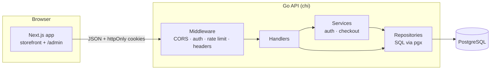
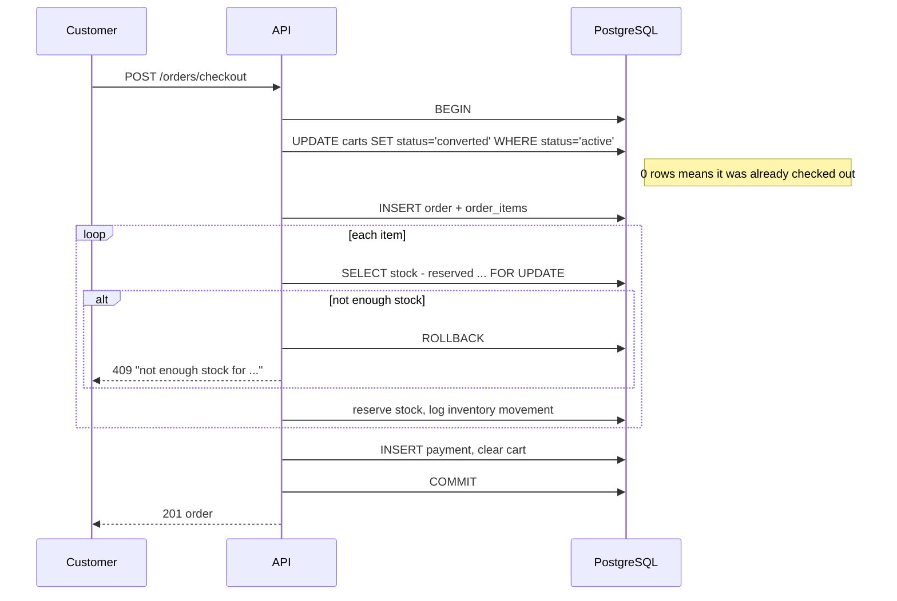

> [!NOTE]
> This project was developed locally in January 2026 and published to GitHub afterwards, so the commit history here doesn't reflect how it was built.

<div align="center">

# ShopX

**A full-stack electronics store: Go REST API, PostgreSQL, and a Next.js storefront with an admin panel.**

[](../../actions/workflows/ci.yml)


</div>

---

## Contents

- [Highlights](#highlights)
- [Screenshots](#screenshots)
- [Features](#features)
- [Architecture](#architecture)
- [Getting started](#getting-started)
- [Configuration](#configuration)
- [API reference](#api-reference)
- [Testing](#testing)
- [Project structure](#project-structure)
- [Roadmap](#roadmap)

## Highlights

- **Checkout never leaves a half-created order.** The order, line items, stock
  reservation, payment record and cart conversion commit in one PostgreSQL
  transaction. Inventory rows are locked with `SELECT … FOR UPDATE`, so two
  shoppers can't buy the last unit, and a double-clicked checkout can't create
  two orders.
- **Cookie-based JWT auth done carefully.** Access tokens live 15 minutes in an
  `httpOnly`, `SameSite=Strict` cookie; refresh tokens are scoped to
  `/auth/refresh` only and carry a token-type claim so they can never be used as
  access tokens. The frontend refreshes silently on a 401.
- **Every customer resource is owner-scoped.** Cart items, orders, wishlist
  items and addresses are always queried with the signed-in user's ID, so
  guessing another user's IDs returns 404.
- **Plain SQL, no ORM.** Handlers → services → repositories on top of `pgx`,
  with versioned migrations embedded in the binary.
- **Tested end to end.** Unit tests cover the auth and middleware logic; CI runs
  `gofmt`, `go vet`, tests, ESLint and a production Next.js build.

## Screenshots

| Storefront | Dark mode |
|---|---|
|  |  |
| **Product page** | **Cart** |
|  |  |

| Admin dashboard | Order management |
|---|---|
|  |  |
| **Product management** | **Mobile** |
|  |  |

## Features

### Storefront
- Product catalog with search, sorting, pagination and per-category pages
- Product pages with image galleries
- Cart, wishlist and checkout with **Cash on Delivery** or **Whish Money**
- Order history and order confirmation pages
- "Just for you" recommendations based on recent searches and purchases
- Light and dark themes, responsive down to phone widths

### Admin panel (`/admin`)
- Dashboard with order, revenue, customer and low-stock counts
- Create, edit, hide and delete products, with images and stock levels
- Category and promotional banner management
- Order status workflow; cancelling an order returns its reserved stock
- Audit log and site settings

### API
- Separate customer and admin accounts (admins are created from the CLI, never through signup)
- Login rate limiting (10 requests per minute per IP)
- Security headers (CSP, HSTS in production, `X-Frame-Options`, …), 1 MB body limit
- Consistent JSON errors: `{"code": "NOT_FOUND", "message": "order not found"}`
- Graceful shutdown and request IDs in structured logs

## Architecture



### Checkout flow



### Tech stack

| Layer | Technology |
|---|---|
| API | Go 1.25, [chi](https://github.com/go-chi/chi), [pgx v5](https://github.com/jackc/pgx), golang-jwt, bcrypt, zerolog |
| Database | PostgreSQL 13+ |
| Frontend | Next.js 16 (App Router), React 19, TypeScript, Tailwind CSS 4, lucide-react |
| Tooling | Docker, docker compose, GitHub Actions |

## Getting started

### Prerequisites

- Go 1.25+
- Node.js 20+
- PostgreSQL 13+, or Docker

### 1. Start PostgreSQL

Use your own instance, or start one in Docker:

```bash
docker compose up -d db
```

### 2. Run the API

```bash
cp .env.example .env
```

Edit `.env`: set `DATABASE_URL` and generate two **different** secrets for
`JWT_SECRET` and `JWT_REFRESH_SECRET`:

```bash
openssl rand -hex 32
```

Then start the server. Migrations run automatically on startup.

```bash
go run .
# listening on :8080
```

### 3. Create an admin account

```bash
go run ./cmd/create-admin -email admin@example.com
# prompts for a password (or set ADMIN_PASSWORD)
```

### 4. Run the frontend

```bash
cd frontend
cp .env.example .env.local
npm install
npm run dev
```

- Storefront: http://localhost:3000
- Admin panel: http://localhost:3000/admin

### Alternative: everything in Docker

```bash
docker compose up --build   # PostgreSQL + API on :8080
cd frontend && npm install && npm run dev
```

The compose file uses development-only secrets; don't use it as-is in production.

## Configuration

The API reads these environment variables (or a `.env` file):

| Variable | Required | Default | Description |
|---|---|---|---|
| `DATABASE_URL` | ✅ | | PostgreSQL connection string |
| `JWT_SECRET` | ✅ | | Access-token signing key, 32+ characters |
| `JWT_REFRESH_SECRET` | ✅ | | Refresh-token signing key, 32+ characters, different from `JWT_SECRET` |
| `PORT` | | `8080` | HTTP port |
| `ENV` | | `development` | `production` turns on `Secure` cookies and HSTS (requires HTTPS) |
| `CORS_ORIGINS` | | `http://localhost:3000` | Comma-separated frontend origins allowed to send cookies |
| `TRUST_PROXY` | | `false` | Read client IPs from `X-Forwarded-For`; enable only behind a reverse proxy |

The frontend needs one variable, `NEXT_PUBLIC_API_URL` (default `http://localhost:8080`).

> **Deploying:** auth cookies are `SameSite=Strict`, so the frontend and API must
> share a registrable domain (for example `shop.example.com` and
> `api.example.com`). Set `ENV=production` and serve both over HTTPS.

## API reference

🔓 public · 👤 signed-in customer · 🛡️ admin

<details>
<summary><b>Auth</b></summary>

| Method | Path | | Description |
|---|---|---|---|
| POST | `/auth/register` | 🔓 | Create a customer account and sign in |
| POST | `/auth/login` | 🔓 | Customer sign-in |
| POST | `/auth/admin/login` | 🔓 | Admin sign-in |
| POST | `/auth/refresh` | 🔓 | Rotate tokens using the refresh cookie |
| POST | `/auth/logout` | 🔓 | Clear auth cookies |
| GET | `/me` | 👤 | Current user |

</details>

<details>
<summary><b>Catalog</b></summary>

| Method | Path | | Description |
|---|---|---|---|
| GET | `/products` | 🔓 | List products. Query: `q`, `category_id`, `category_slug`, `sort` (`price_asc`, `price_desc`, `sales_desc`), `limit` (max 100), `offset` |
| GET | `/products/{id-or-slug}` | 🔓 | Product with images and variants |
| GET | `/products/{id}/reviews` | 🔓 | Product reviews |
| GET | `/categories` | 🔓 | Categories |
| GET | `/brands` | 🔓 | Brands |
| GET | `/banners` | 🔓 | Active promotional banners |
| GET | `/settings/{key}` | 🔓 | Public site setting |

</details>

<details>
<summary><b>Cart, orders, wishlist, addresses</b></summary>

| Method | Path | | Description |
|---|---|---|---|
| GET | `/cart` | 👤 | Cart with items and subtotal |
| POST | `/cart/items` | 👤 | Add an item (`product_id`, `quantity` 1–99) |
| PUT | `/cart/items/{id}` | 👤 | Change quantity |
| DELETE | `/cart/items/{id}` | 👤 | Remove an item |
| POST | `/orders/checkout` | 👤 | Place an order from the cart |
| GET | `/orders` | 👤 | My orders |
| GET | `/orders/{id}` | 👤 | One of my orders |
| GET | `/payment-methods` | 👤 | Available payment methods |
| GET | `/wishlist` | 👤 | My wishlist |
| POST | `/wishlist/items` | 👤 | Add a product |
| DELETE | `/wishlist/items/{id}` | 👤 | Remove an item |
| GET / POST | `/addresses` | 👤 | List or add addresses |
| DELETE | `/addresses/{id}` | 👤 | Delete an address |

</details>

<details>
<summary><b>Admin</b></summary>

| Method | Path | | Description |
|---|---|---|---|
| GET | `/admin/dashboard` | 🛡️ | Store statistics |
| POST / PUT / DELETE | `/admin/products[/{id}]` | 🛡️ | Manage products (`?force=true` hard-deletes) |
| PUT | `/admin/products/{id}/images` | 🛡️ | Replace product images |
| POST / PUT / DELETE | `/admin/categories[/{id}]` | 🛡️ | Manage categories |
| GET | `/admin/orders` | 🛡️ | All orders |
| PUT | `/admin/orders/{id}/status` | 🛡️ | Update order status |
| POST | `/admin/inventory/adjust` | 🛡️ | Adjust stock |
| GET / POST / PUT / DELETE | `/admin/banners[/{id}[/toggle]]` | 🛡️ | Manage banners |
| GET / PUT | `/admin/settings` | 🛡️ | Site settings |
| GET | `/admin/audit-logs` | 🛡️ | Audit log |

</details>

## Testing

```bash
# API
go test ./...
go vet ./...

# Frontend
cd frontend
npm run lint
npm run build
```

GitHub Actions runs all of these on every push and pull request
([`.github/workflows/ci.yml`](.github/workflows/ci.yml)).

## Project structure

```
.
├── main.go                   # wiring, HTTP server, graceful shutdown
├── cmd/
│   └── create-admin/         # CLI to create admin accounts
├── internal/
│   ├── apierror/             # JSON error responses
│   ├── config/               # env config; fails fast on missing secrets
│   ├── db/
│   │   ├── migrate.go        # versioned migration runner
│   │   └── migrations/       # *.sql, embedded into the binary
│   ├── handler/              # HTTP handlers
│   ├── middleware/           # auth, CORS, rate limiting, security headers
│   ├── models/               # domain types
│   ├── repository/           # SQL queries (pgx)
│   ├── router/               # route table
│   └── service/              # auth and checkout logic
├── frontend/
│   ├── app/                  # routes: storefront pages and /admin
│   ├── components/           # shared UI
│   ├── context/              # auth, cart, wishlist, theme, toast providers
│   └── lib/api.ts            # typed API client with silent token refresh
├── docs/screenshots/
├── Dockerfile
└── docker-compose.yml
```

### Adding a migration

Create the next numbered file in `internal/db/migrations/`, for example
`003_add_coupons.sql`. It runs once, in its own transaction, on the next
startup, and is recorded in the `schema_migrations` table.

## Roadmap

- [ ] Send the Whish Money transaction reference to the API so admins can verify payments
- [ ] Customer-facing review submission
- [ ] Coupons and promotions (the tables already exist)
- [ ] Shipment tracking
- [ ] Integration tests against a real PostgreSQL in CI
